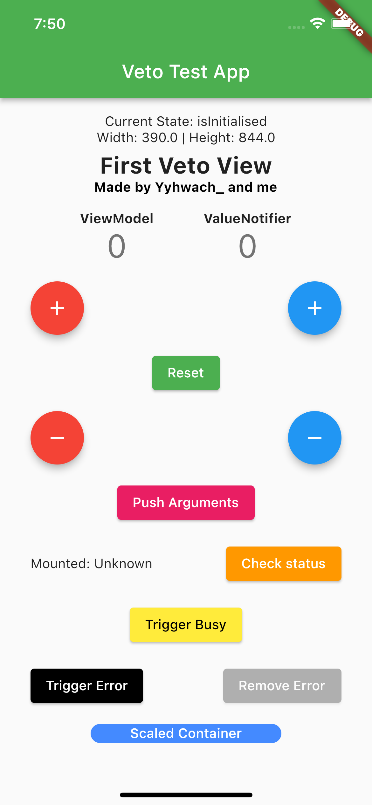

# 📚 Veto

> *A lightweight MVVM state management solution originally inspired by the [FilledStacks](https://www.filledstacks.com/) [stacked](https://pub.dev/packages/stacked) package.*
>



<aside>
💡 The example project demonstrates every functionality of this package.

</aside>

## Features

- Easy management of view models' lifecycle
- Automatic handling of initialization and disposal
- Support for view model states like initialising, initialised, busy, and error
- Reactive rebuilding of the widget tree when the view model's state changes
- Access to the build context within view models

## Getting started

To use this package, add `veto` as a dependency in your `pubspec.yaml` file.

### Importing

Import the package into your file:

```dart
import 'package:veto/veto.dart';
```

## Usage

### ViewModelBuilder

The `ViewModelBuilder` widget is the core class responsible for providing a view model to the widget tree and managing its lifecycle.

Use the `ViewModelBuilder` like this:

```dart
ViewModelBuilder<MyViewModel>(
  viewModelBuilder: () => MyViewModel(),
  builder: (context, model) {
    return Scaffold(
      appBar: AppBar(title: Text('Veto Example')),
      body: model.isBusy
          ? CircularProgressIndicator()
          : Text('Hello World!'),
    );
  },
)
```

Here, `MyViewModel` extends `BaseViewModel`.

### BaseViewModel

Create your custom view model by extending the `BaseViewModel` class:

```dart
class MyViewModel extends BaseViewModel {
  int _counter = 0;

  int get counter => _counter;

  void incrementCounter() {
    setBusy(true);
    wait(1000).then((_) {
      _counter++;
      setBusy(false);
      rebuild();
    });
  }
}
```

In your view model, you can:

- Define properties and methods
- Access the `context` property (e.g., for navigation)
- Call `rebuild` to rebuild the widget tree
- Use `setBusy` and `setError` to manage the view model state

### ViewModelState

`ViewModelState` is an enumeration that defines the different states a `BaseViewModel` can be in:

- `isInitialising`: The view model is currently initializing
- `isInitialised`: The view model has finished initializing
- `isBusy`: The view model is currently busy (e.g., fetching data)
- `hasError`: The view model has encountered an error

You can use the `ViewModelState` enum to display different UI based on the view model's state:

```dart
@override
Widget build(BuildContext context) {
  return ViewModelBuilder<MyViewModel>(
    viewModelBuilder: () => MyViewModel(),
    builder: (context, model) {
      Widget? content;
      switch (model.state) {
        case ViewModelState.isInitialising:
          content = CircularProgressIndicator();
          break;
        case ViewModelState.isInitialised:
          content = Text('Hello World!');
          break;
        case ViewModelState.isBusy:
          content = CircularProgressIndicator();
          break;
        case ViewModelState.hasError:
          content = Text('An error occurred');
          break;
      }
      return Scaffold(
        appBar: AppBar(title: Text('Veto Example')),
        body: content,
      );
    },
  );
}
```

## Examples

Please see the `example` folder for a complete example of using Veto in a Flutter application.

## Contributing

Contributions are welcome! If you find a bug or have a feature request, please open an issue.


---

The entire package has extensive documentation. Reading the `BaseViewModel` class from top to bottom will give you a good idea of the benefits of this package. Also, a good example project, proper unit tests and some widget tests have been added pto illustrate and test the most important features of this package. If you have any questions feel free to contact me through [codaveto.com](https://www.codaveto.com).
